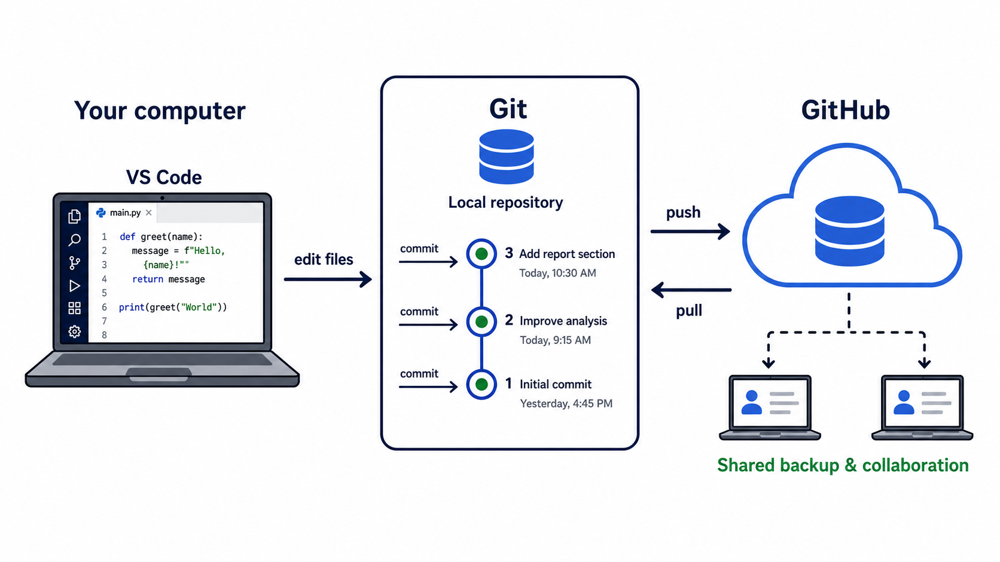

## Getting started

- Who has used AI tools before? What for? How was your experience?
- Who has written code to analyze data or solve a problem? What language(s)? How was your experience?
- Who has used Git or GitHub before? How was your experience?

## The big picture{.scrollable}

```{=html}
<div style="max-width: 930px; margin: 4% auto 0; text-align: center;">
  <div style="border: 3px solid #1f4e79; border-radius: 18px 18px 8px 8px; padding: 18px 30px; background: #eef5fb;">
    <div style="font-size: 1.35em; font-weight: 700; color: #173b5c;">Artificial intelligence (AI)</div>
    <div style="font-size: .76em; margin-top: 6px; color: #344054;">Generative AI can produce text, code, images, and other content.</div>
  </div>
  <div style="height: 38px; width: 3px; background: #1f4e79; margin: 0 auto;"></div>
  <div style="height: 3px; width: 62%; background: #1f4e79; margin: 0 auto;"></div>
  <div style="display: flex; justify-content: space-between; width: 62%; margin: 0 auto;">
    <div style="height: 30px; width: 3px; background: #1f4e79; margin-left: 10%;"></div>
    <div style="height: 30px; width: 3px; background: #1f4e79; margin-right: 10%;"></div>
  </div>
  <div style="display: flex; justify-content: center; gap: 34px; text-align: left;">
    <div style="width: 37%; border: 3px solid #2f6f66; border-radius: 14px; padding: 20px 24px; background: #eef8f6;">
      <div style="font-size: 1.08em; font-weight: 700; color: #24564f;">Chatbot</div>
      <div style="margin-top: 10px; font-size: .7em; line-height: 1.35;">A conversation interface for asking questions and receiving generated responses.</div>
      <div style="margin-top: 15px; padding-top: 12px; border-top: 1px solid #9bc9c1; font-size: .72em;"><strong>Context:</strong> your prompt and what you provide.</div>
    </div>
    <div style="width: 37%; border: 3px solid #8a5a1f; border-radius: 14px; padding: 20px 24px; background: #fff7e9;">
      <div style="font-size: 1.08em; font-weight: 700; color: #724918;">Coding agent</div>
      <div style="margin-top: 10px; font-size: .7em; line-height: 1.35;">An AI assistant that helps work on a software or analysis project.</div>
      <div style="margin-top: 15px; padding-top: 12px; border-top: 1px solid #e0bd7e; font-size: .72em;"><strong>Context:</strong> prompt, project files, terminal output, and tools.</div>
    </div>
  </div>
</div>
<div style="margin-top: 28px; text-align: center; font-size: .9em; color: #344054;">
  <strong>Key idea:</strong> Both are AI tools; a coding agent is designed to work with the files and tools in a project.
</div>
```

## AI

- **Artificial intelligence (AI)** is a broad label for computer systems that perform tasks associated with human cognition: recognizing patterns, making predictions, or generating content.
- **Generative AI** produces new text, code, images, or other outputs in response to an instruction.

## A chatbot is a conversation interface

- You provide a **prompt**: a question, instruction, or request.
- The chatbot responds using the information in that conversation and any material you explicitly provide.
- A chatbot does not automatically know your research question, your files, or your knowledge.

## A coding agent works with a project

- A **coding agent** can be given access to a folder of files and tools such as a terminal or test runner.
- It can read code, propose edits, create files, and execute those files.
- Its **context** is the information your agent can see: your prompt, project files, data.


## VS Code: our visible workspace

[VS Code](https://code.visualstudio.com/) is a development environment. It brings several useful views together:

- **Explorer:** the files in a project;
- **Editor:** the code or text you can read and edit;
- **Terminal:** where you run code and see its output;
- **Source Control:** where you inspect changes (interact with Git); and
- **Chat:** where you can ask an AI assistant questions about the work.

## Git: a local history of changes

Like track changes, Git records a project’s history on your own computer.

- A **diff** shows exactly what changed.
- A **commit** is a named checkpoint: a small, purposeful set of changes plus a message explaining why.
- A **repository** is a project folder whose history Git tracks.

Git makes changes inspectable and reversible.

## GitHub: a shared home for a repository

GitHub is an online service for storing and sharing Git repositories.

- backup and access a project across machines;
- share code and collaborate; and
- review the history behind an analysis or assignment.

**Git is the history system; GitHub is a place to host and share that history.**

## The workflow we will practice

```{=html}
<div style="display: flex; align-items: stretch; justify-content: center; gap: 10px; margin: 9% auto 0; max-width: 980px; text-align: center;">
  <div style="width: 22%; padding: 20px 12px; border-radius: 14px; background: #eef5fb; border-top: 6px solid #1f4e79;">
    <div style="font-size: .7em; color: #1f4e79; font-weight: 700;">1</div>
    <div style="font-size: 1.02em; font-weight: 700;">Define</div>
    <div style="font-size: .62em; margin-top: 10px; line-height: 1.3;">State the question and the task.</div>
  </div>
  <div style="font-size: 1.35em; align-self: center; color: #667085;">→</div>
  <div style="width: 22%; padding: 20px 12px; border-radius: 14px; background: #eef8f6; border-top: 6px solid #2f6f66;">
    <div style="font-size: .7em; color: #2f6f66; font-weight: 700;">2</div>
    <div style="font-size: 1.02em; font-weight: 700;">Build</div>
    <div style="font-size: .62em; margin-top: 10px; line-height: 1.3;">Write code; use AI for a transparent draft.</div>
  </div>
  <div style="font-size: 1.35em; align-self: center; color: #667085;">→</div>
  <div style="width: 22%; padding: 20px 12px; border-radius: 14px; background: #fff7e9; border-top: 6px solid #8a5a1f;">
    <div style="font-size: .7em; color: #8a5a1f; font-weight: 700;">3</div>
    <div style="font-size: 1.02em; font-weight: 700;">Check</div>
    <div style="font-size: .62em; margin-top: 10px; line-height: 1.3;">Run it, inspect output, and review the diff.</div>
  </div>
  <div style="font-size: 1.35em; align-self: center; color: #667085;">→</div>
  <div style="width: 22%; padding: 20px 12px; border-radius: 14px; background: #f4f0fa; border-top: 6px solid #6a4c93;">
    <div style="font-size: .7em; color: #6a4c93; font-weight: 700;">4</div>
    <div style="font-size: 1.02em; font-weight: 700;">Record &amp; share</div>
    <div style="font-size: .62em; margin-top: 10px; line-height: 1.3;">Commit meaningful checkpoints; back up on GitHub.</div>
  </div>
</div>
```

## Live demo: a tiny, inspectable project

We will use `ai-workflow-demo/`, which contains only:

```text
ai-workflow-demo/
├── README.md                 # what this project does and how to run it
├── analysis.R                # a small base-R analysis
└── data/
    └── monthly_sales.csv     # six observations
```

The point is not the analysis. The point is seeing the complete workflow.

## Demo, part 1: orient yourself

1. Open `ai-workflow-demo/` as its own folder in VS Code.
2. Read `README.md`.
3. Open `analysis.R` and `data/monthly_sales.csv`.
4. In the terminal, run `Rscript analysis.R`.


## Demo, part 2: use chat deliberately

Select `analysis.R` and ask the assistant:

> Explain this script to a student who is new to R. Identify the input file, each calculation, and the expected output. Do not change any files.

Then ask:

> Add a sentence to the README explaining how the script treats missing values. Make only that documentation change.

Before accepting anything, read the proposed edit.

## Demo, part 3: inspect, run, record

1. Open **Source Control** and view the diff.
2. Check that the changed sentence says what the code actually does.
3. Run `Rscript analysis.R` again.
4. Initialize a Git repository, stage the files, and make a commit:

```bash
git init
git add README.md analysis.R data/monthly_sales.csv
git commit -m "Add a small monthly sales example"
```

5. Make the README documentation change a second, separate commit.

## Git-GitHub workflow

{fig-alt="Diagram showing work in VS Code flowing into a local Git repository, where commits create a history; GitHub is an online shared backup connected by push and pull." width="90%"}

## What to notice in the demo

- AI was asked to **explain** before it was asked to change anything.
- The requested change was small and easy to review.
- A diff made the proposed change visible.
- Separate commits tell the project’s story one change at a time.


## Takeaway

- AI is changing how we work with code, data, and models. 
- AI can also change how we learn. Ask it to explain, summarize, or illustrate a concept or code.
- Git/GitHub making working with AI-assisted code inspectable, reversible, and shareable.

## Tips

- VS Code (or your favorite IDE)
- Configure your preferred subscription (e.g., OpenAI, Google, or Anthropic)
- Install git and sign up for a GitHub account
- Ask AI chat to walk your through setup
